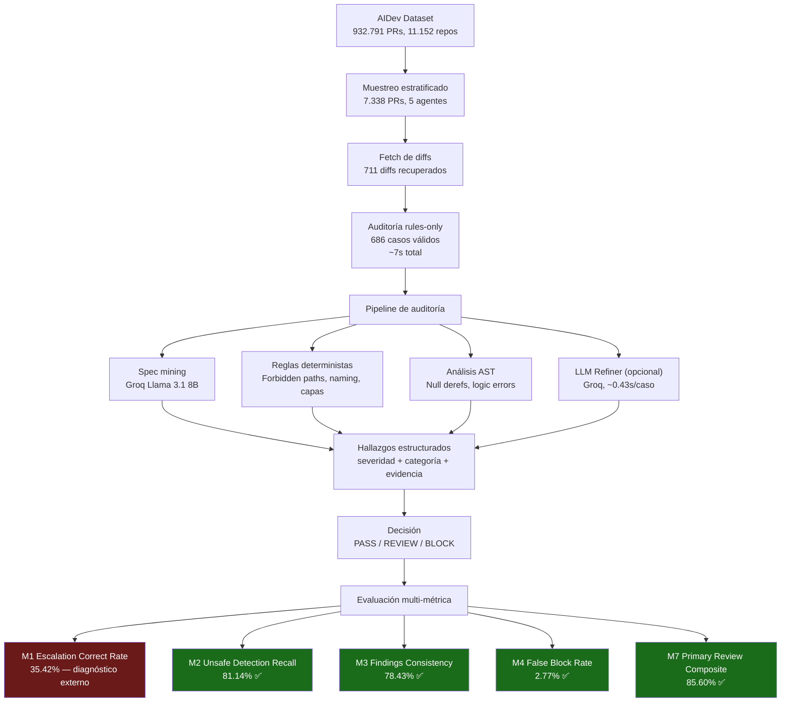

# Pipeline de evaluación Layer 3 — HarnessCI

## Resultados clave

| Estrategia | Valor | Target |
|---|---|---|
| M2 Unsafe Detection Recall | **81.14%** | ✅ 75%+ |
| M3 Findings Consistency | **78.43%** | ✅ 75%+ |
| M4 False Block Rate | **2.77%** | ✅ <3% |
| M7 Primary Review Composite | **85.60%** | ✅ 75%+ |
| Approach 1 Primary Composite | **85.60%** | ✅ 75%+ |
| Approach 2 Primary Composite | **93.71%** | ✅ 75%+ |

## Ranking por agente

| Agente | n | Primary Composite |
|---|---|---:|
| Devin | 179 | **91.01%** |
| Cursor | 119 | **88.17%** |
| Claude_Code | 141 | **82.75%** |
| OpenAI_Codex | 130 | **82.33%** |
| Copilot | 117 | **81.00%** |
